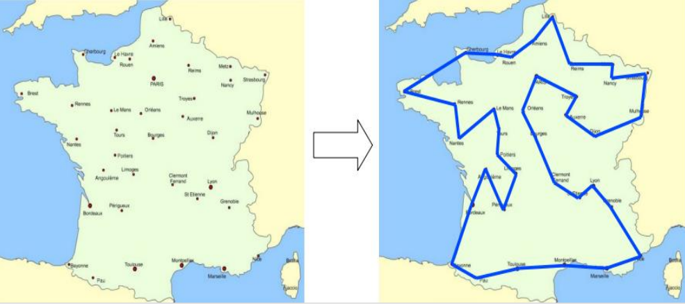
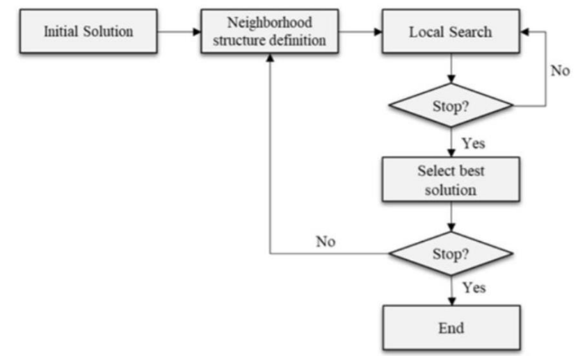

# Traveling Salesman Problem Solver

## Overview
This repository provides solutions for the Traveling Salesman Problem (TSP) using both dynamic programming and a metaheuristic approach, specifically the General Variable Neighborhood Search (GVNS). The aim is to compare the efficacy and performance of these methods on different instances of TSP problems, emphasizing why certain methods are preferred for larger instances.

## Introduction to TSP
The Traveling Salesman Problem (TSP) is a well-known combinatorial optimization problem, which requires finding the shortest possible route that visits a list of cities and returns to the origin city. It is NP-hard, meaning that the time required to solve the problem increases exponentially with the number of cities.


## Methods Used

### Dynamic Programming
Dynamic Programming (DP) solves problems by breaking them down into simpler subproblems and storing the results of these subproblems to avoid computing the same results multiple times. For TSP, the DP approach ensures finding an optimal solution by exploring all possible tours. The time complexity of this method is O(n^2 * 2^n), which becomes impractical for larger datasets due to its exponential growth in computation requirements.

### Metaheuristic: General Variable Neighborhood Search (GVNS)
Metaheuristics are strategies designed to find, generate, or select heuristics that may provide a sufficiently good solution to an optimization problem, especially with incomplete or imperfect information. GVNS is a robust metaheuristic that systematically changes the neighborhood structures within which local search is applied, aiming to bring a good balance between exploring new regions and exploiting known promising areas. The time complexity of GVNS is generally more favorable than DP, often closer to polynomial time, depending on the specific configurations and the instance being solved.


## Project Structure

- `TSP_programmation_dynamique.ipynb`: Implementation of the TSP using the dynamic programming approach.
- `TSP_Métaheuristique_GVNS.ipynb`: Implementation of the TSP using a metaheuristicc method, General variable neighborhood search (GVNS).
- `data/`: Directory containing sample TSP problem datasets.
- `results/`: Directory where results and graphs are saved.

## Technologies
- Python 3.8+
- NumPy
- Matplotlib (for visualization)

## Results
We tested our implementations on four instances of the TSP. For instances 1 and 2, both methods were applied. However, due to the exponential growth of computational requirements, the dynamic programming approach was not used for instances 3 and 4. Results showed that:

- **Instances 1 and 2:** Dynamic programming finds the optimal solution but is slower compared to GVNS.
- **Instances 3 and 4:** GVNS provides near-optimal solutions with significantly reduced computational time.

## Visualizations
The `results/visualizations/` directory contains charts and plots comparing the performance of dynamic programming versus GVNS, including time complexity and the length of the tours.

## Conclusion
The findings from this project underscore the limitations of dynamic programming in handling larger TSP instances and demonstrate the effectiveness of GVNS as a scalable alternative for larger datasets. GVNS not only handles larger instances efficiently but also maintains closeness to the optimal solutions.

## Contributing
Contributions are welcome! Please fork the project, create a feature branch, and submit a pull request for review.

## License
This project is licensed under the MIT License - see the `LICENSE.md` file for details.

## References
- Danzig, G.B., Fulkerson, D.R., and Johnson, S.M., "Solution to the Traveling-Salesman Problem", Operations Research, 1952.
- Mladenovic, N., Hansen, P., "Variable Neighborhood Search", Computers & Operations Research, 1997.

## Authors
- BADI Oumaima
- BENLAGOTE Zainab
  
## Setup
Clone this repository :
```bash
git clone https://github.com/OumaimaBadi/Traveling-Salesman-Problem-Solver.git
cd <your-repository-directory>
